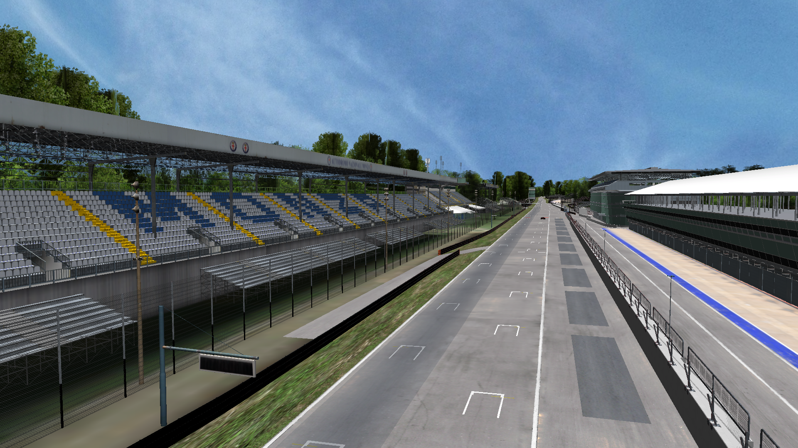
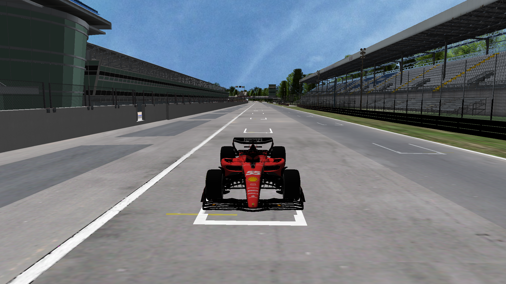
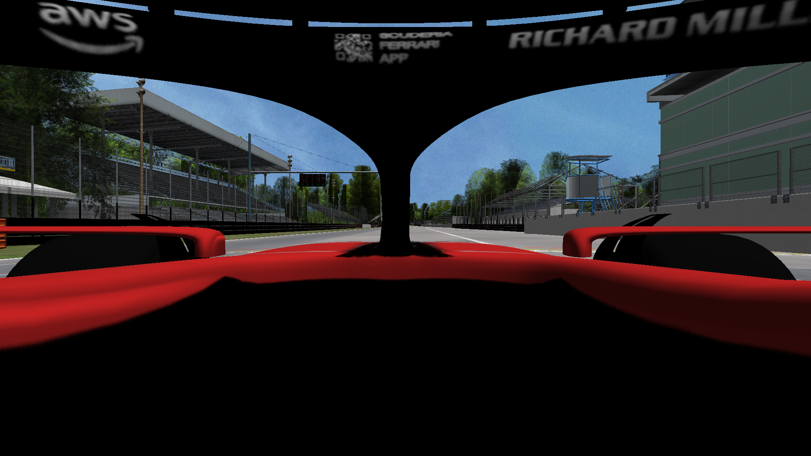

# Bolide

A 3D racing game project developed in **C++** using **OpenGL**. The goal of the project is to create an environment where the player can control a **Formula 1** car driving on a recreated **Monza** circuit.

The project is developed as a desktop application for Windows using Visual Studio.

## Current Features

The current version of the project includes:

- 3D scene rendering using OpenGL,
- a recreated Monza circuit,
- a 3D Formula 1 car model,
- textures and materials,
- a surrounding skybox,
- directional lighting,
- shadow mapping,
- depth testing,
- object transparency using blending,
- car movement based on its current orientation,
- several camera modes.

## Game Screenshots

### Track View

### Bolide Front View

### Bolide Back View

### Driver / Cockpit View

## 3D Assets

The project uses 3D models sourced from **Sketchfab**. The original models and their respective copyrights belong to their authors. The links below lead to the original model pages.

### 🏁 Autodromo Nazionale Monza Circuit

**Asset:** Autodromo Nazionale Monza Circuit – 2020 Layout  
**Source:** [View model on Sketchfab](https://sketchfab.com/3d-models/autodromo-nazionale-monza-circuit-2020-layout-25ed955115094de382935aa6d1a1e9c6)

The model is used as the main racing environment and provides the 3D representation of the Monza circuit.

### 🏎️ Scuderia Ferrari F1 SF23

**Asset:** Scuderia Ferrari F1 SF23 – 2023  
**Source:** [View model on Sketchfab](https://sketchfab.com/3d-models/scuderia-ferrari-f1-sf23-2023-ecb0f812bc454331bbe721655b0780ec)

The model is used as the main playable bolide in the project.

> **Credits:** The 3D assets are used for educational and development purposes. Please refer to the original Sketchfab pages for information about the creators and the licenses under which the models were published.

## 3D Scene

The main scene consists of a **Monza** circuit model with a **Formula 1** bolide placed on the track. Separate shaders are used for the main objects and the skybox. Shadows are generated in a separate rendering pass using a depth map.

## Camera Modes

The camera can operate in several modes:

| Key | Mode |
|---|---|
| `0` | Free camera |
| `1` | Driver head view |
| `2` | Camera behind the bolide |
| `3` | Front view |

### Free Camera

In free camera mode, the camera can be moved around the scene. The viewing direction is controlled with the mouse movement and while holding the right mouse button.

## Controls

| Key | Action |
|---|---|
| `↑` | Accelerate |
| `↓` | Brake / reverse |
| `←` | Turn left |
| `→` | Turn right |
| `P` | Stop the bolide |
| `ESC` | Exit the application |

The bolide movement is calculated relative to its current orientation, so accelerating moves the car in the direction in which it is facing.

## Technologies and Libraries

The project uses:

- **C++20**,
- **OpenGL** – 3D graphics rendering,
- **GLFW** – window, keyboard and mouse handling,
- **GLEW** – OpenGL extension handling,
- **GLM** – mathematical operations and 3D transformations,
- **Assimp** – 3D model importing,
- **SOIL2** – texture loading,
- **GLSL** – vertex and fragment shader programming.

The required libraries are included in the `Dependencies/` directory.

## Future Development

The next planned step is to **implement gravity and more advanced physics for the bolide**.

Gravity will be particularly important because the track is not completely flat and contains changes in elevation. Ultimately, the bolide's movement should take the actual shape and height of the track into account instead of simply moving across the XZ plane.

Further improvements to the physics and driving behavior are also planned to make the movement of the bolide more realistic.

## Project Status

The project is currently under development. The basic rendering system, 3D models, camera system and basic bolide movement have already been implemented. Further development is focused on expanding the physics system and improving the realism of driving.
